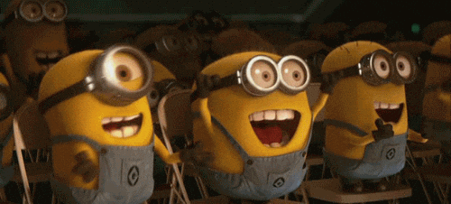

```{r}
#| label: manip-img
#| include: false
#| eval: false
library("magick")
img <- image_read("img/cover-letter-LKelly.jpg") |> 
  image_rotate(180) |> 
  image_scale("600")

img2 <- image_draw(img)
rect(110, 160, 210, 180, border = "black", col = "black")
rect(135, 270, 210, 290, border = "black", col = "black")
dev.off()
print(img2)

img3 <- image_crop(img2, "1000x300+0+300")

image_write(img2, "img/primeira-carta.png")
image_write(img3, "img/primeira-cartab.png")
```


```{r}
#| label: setup
#| include: false
options(htmltools.dir.version = FALSE)

knitr::opts_chunk$set(echo = FALSE,
                      collapse = TRUE,
                      warning = FALSE,
                      message = FALSE,
                      fig.retina = 3,
                      out.width = "100%")
library("xaringanthemer")
library("metathis")
library("knitcitations")
library("knitr")

library("dplyr")
library("tibble")

library("emoji")

library("RefManageR")
# xaringan::summon_remark() # slides offline
```

```{r}
#| label: xaringan-themer
#| include: false
dark_yellow <- "#EFBE43"
light_yellow <- "#fdfbd4"
gray <- "#333333"
blue <- "#4466B0"
dblue = "#1C2B4A"
paleta <- c(
  marrom        = "#8C2E03",
  vinho          = "#8F003E",
  roxo   = "#420C8D",
  zomp          = "#38A88E",
  shadow        = "#87826E",
  blue2          = "#1381B0",
  yellow_orange = "#FF961C",
  blue3 = "#1C2B4A",
  lavanda = "#D3D3FF",
  verde_pastel = "#173317",
  verde_torquoise = "#244f4b",
  blue_navy = "#000080",
  vermelho = "#C43D2D"
  )

style_duo(
  primary_color = light_yellow,
  secondary_color = dark_yellow,
  header_color = gray,
  text_color = gray,
  code_inline_color = colorspace::lighten(gray),
  text_bold_color = colorspace::lighten(gray),
  inverse_text_color = dblue,
  link_color = blue,
  title_slide_text_color = blue,
  text_font_size = "1.5rem",
  # fonts
  header_font_google = google_font("Martel"),
  text_font_google = google_font("Lato"),
  code_font_google = google_font("Fira Mono"),
  
  # paleta de cores
  colors = paleta

)
```

```{r}
#| label: xaringanExtra
#| include: false
xaringanExtra::use_xaringan_extra(c("tile_view","tachyons"))
```

```{r}
#| label: xaringanExtra-share-again
#| include: false
xaringanExtra::use_share_again()
```

```{r}
#| label: style-share-again
#| include: false
xaringanExtra::style_share_again(
  share_buttons = c("twitter", "facebook","linkedin", "reddit")
)
```

```{r}
#| label: broadcast
#| include: false
#| eval: false
# xaringanExtra::use_broadcast()
```

```{r}
#| label: emoji
#| include: false
cafe <-
  emojis |> 
  filter(name == "teacup without handle") |>
  pull(emoji)

vergonha <- 
  emojis |> 
  # filter(grepl("face", name))
  filter(name == "man facepalming") |> 
  pull(emoji) %>%
  .[[1]]

interrogacao <-
  emojis |> 
  filter(name == "red question mark") |>
  pull(emoji)
  
cerebro <- 
  emojis |> 
  filter(name == "brain") |>
  pull(emoji)

pensar <- 
  emojis |> 
  filter(name == "thinking face") |>
  pull(emoji)
```

```{r}
#| label: metathis
#| eval: true
#| include: false
meta() |>
  meta_name("github-repo" = "ricoperdiz/2025_02_SubmissaoArtigos") |>
  meta_social(
    title = "Submissão de artigos científicos",
    description = paste(
      "Palestra de autoria de Ricardo Perdiz sobre o processo de submissão de artigos científicos,",
      "apresentada dentro da disciplina de 'Comunicação Científica' ministrada no ano de 2025 pelos professores Dra. Franciele Oliveira Campos da Rocha (UFRR), Dr. Ricardo Perdiz (UFRR) e Dr. Umberto Zottich Pereira (UFRR)",
      "e ofertada no Programa de Pós-graduação em Recursos Naturais (PRONAT) da Universidade Federal de Roraima."
    ),
    url = "https://ricoperdiz.github.io/2025_02_SubmissaoArtigos/",
    image = "https://github.com/ricoperdiz/2025_02_SubmissaoArtigos/blob/main/img/slide_social.png?raw=true",
    image_alt = paste(
      "Imagem de abertura da apresentação, mostrando cientistas escrevendo textos, mexendo em livros. Há imagens de livros, ADN e um computador na figura."
    ),
    og_type = "website",
    og_author = "R. O. Perdiz",
    twitter_card_type = "summary_large_image",
    twitter_creator = "@ricoperdiz",
    twitter_site = "@ricoperdiz"
  )
```

```{r}
#| label: functions
#| include: false
pb <- function(key) {
  TextCite(bib = bibf, key, .opts = list(
    style = "markdown", 
    hyperlink = "to.doc")
    )
}
```

```{r}
#| label: load_refs
#| include: false
bibf <- ReadBib("bib.bib", check = FALSE)
bibf
```

background-image: url(img/slide_abertura.png)
background-size: contain
background-color: "#EFBE43"


<!-- .big.bg-light-blue.b--dark-blue.ba.bw3.br3.shadow-5.ph5.mt5 -->

.left[
.bg-yellow.ba.bw3.br4.light-yellow.ph2.mt5.w-25[
.black[
.b.f2[Submissão<br>de artigos<br>científicos]
]
]
]
.left[

.black.bg-yellow.ba.bw3.br4.light-yellow.ph2.mt5.w-20[

.black.b.f3-ns.fw9-ns[
Ricardo Perdiz
]
.black.f4-m[
.i[PRONAT UFRR]<br>12 Fev 2025
]
]]
???

Crédito da imagem: [Gemini](https://gemini.google.com)

---

# Plano de aula

+ Escolha do periódico

--

+ Normas

--

+ Carta de submissão

--

+ Submissão

--

+ Pós-submissão

---

# Objetivos da aula

Dar elementos para responder:

--

+ O que devo fazer para submeter um artigo?

--

+ Qual periódico eu devo escolher para submeter um artigo?

--

+ Quais normas eu devo seguir para formatar o manuscrito?

--

+ De que forma eu submeto o trabalho?

--

+ O que acontece após a submissão?

???

A apresentação de hoje detalhará o processo completo de submissão de um artigo científico a um periódico, incluindo: 

+ seleção do periódico adequado;
+ preparo do manuscrito de acordo com as normas da revista;
+ escrita de uma carta de submissão convicente;
+ passar pelo processo de revisão de pares
+ compreender os possíveis resultados: aceite, revisão, ou rejeição
+ reforçar o ajuste do texto ao escopo e às normas da revista.  

---
name: citacao

<br>

.big.bg-light-blue.b--dark-blue.ba.bw3.br3.shadow-5.ph5.mt5[
Não pode haver escrita clara sem pensamento claro, e aquele que aprende a escrever claramente, no processo, aprenderá a pensar claramente.
]

.footnote[
.huge[
`r pb("Miers1911")`
]
]

???

There cannot be clear writing without clear thinking, and he who learns to write clearly will in the process learn to think clearly.

Miers, H. A. 1911. The cultivation of lucidity in scientific writings. Nature 87(2188): 465.  https://doi.org/10.1038/087465b0

---

name: cerebro
class: inverse, center, middle

# Antes de submeter ...

## `r cerebro` `r cerebro` `r cerebro`

## .bg-light-yellow[`r pensar` `r pensar` `r pensar`]

---

# Pergunte pra si:

.mh5[
.bigger[
* Meu texto está .b.green[enxuto?]
]]

--

.mh5[
.bigger[
* As informações em cada seção são realmente .b.pink[importantes] para tal?
]]

--

.mh5[
.bigger[
* São .b.blue3[necessárias] para o leitor .b.green[entender] e .b.blue3[prever] o objetivo do estudo?
]]

--

.mh5[
.bigger[
* São .b.marrom[necessárias] para .b.pink[defender] suas conclusões ?
]]

---

# Pergunte pra si:

.pull-left[


]

.pull-right.bigger[
* As informações são .b.marrom[necessárias] para .b.blue3[repetir] seu estudo?

* Para .b.green[ACEITAR] suas conclusões?
]


???

Crédito da imagem: [freepik.com - Young hispanic woman working at scientist laboratory clueless and confused expression with arms and hands raised. doubt concept.](https://www.freepik.com/free-photo/young-hispanic-woman-working-scientist-laboratory-clueless-confused-expression-with-arms-hands-raised-doubt-concept_42557319.htm)

---

name: etapas

background-image: url("img/doctor-with-blue-folder-pointing-somewhere-somebody.png")
background-size: 65%
background-position: right

# Etapas do processo

--

## Fase pré-submissão

## Submissão

## Pós-submissão

???

Crédito da imagem: [freepik.com](https://freepik.com)

---

# Fase pré-submissão

--

### Escolha do periódico adequado à pesquisa

--

### Preparo do manuscrito

--

.bigger[Escrita e ajuste segundo<br>.b.dark-blue[as normas do periódico]]

--

.bigger.b.blue2[Estrutura] (.b[Intro, Métodos, Resultados, Discussão, Conclusão, Referências, Material Suplementar])

--

.b[Linguagem .bigger.verde_torquoise[clara] e .bigger.roxo[concisa] com terminologia .bigger.vinho[apropriada]]

---

.pull-left[

<br>
<br>

```{r}
#| out-width: "80%"

```


]

--

### .bigger[.b.red[Carta de submissão]]

--

## .mh6[## .b.vinho[Submissão]]

--

## Pós-submissão

--

### .b.dark-blue[Revisão por pares] (*double-blind peer review*)


???

Crédito da imagem: [giphy.com](https://giphy.com/gifs/latenightseth-lol-seth-meyers-lnsm-QumnfihD4ibhRUqGcH)

---

background-image: url(img/fluxograma-ridh.png)
background-size: contain

???

Crédito da imagem: [Revista Interdisciplinar de direitos humanos](https://www2.faac.unesp.br/ridh3/index.php/ridh/about/submissions)

Mostrar as fases:

+ pré-submissão;
+ submissão
+ pós-submissão

---
name: periodicos
class: inverse, center, middle


# Escolha do periódico

---
name: id-periodicos
background-image: url(img/article-publish.jpg)
background-position: right
<!-- background-size: contain -->
background-size: 500px


## Identificar periódicos<br>relevantes para sua pesquisa

--

### Escopo

--

### Fator de impacto

--

### .b.roxo.fw7[Acesso aberto]
--

### Normas

--

- Formatação
- limite de palavras/página
- estilo de citação

???

Crédito da imagem: [freepik.com](https://www.freepik.com/free-vector/publish-article-concept-illustration_396952387.htm#fromView=search&page=1&position=13&uuid=b06939a0-ad4e-4d4f-a8ce-3a9f367cbe1b&query=article+submission)

---
name: normas
class: inverse, center, middle

# Ajuste do texto seguindo as normas

---
class: normas-espec

<br>
<br>

## Formatação (fonte, tamanhos, espaçamento, margens etc)

--

## Limite de palavras/páginas

--

## Estilo de citação

--

## Estilo da linguagem

--

## Estrutura do texto

---
name: carta-submissao
class: center, bottom, inverse

# Carta de submissão

--

## Ajuda a .bigger.b.lavanda[vender] seu trabalho!

--

### Apresentação do seu trabalho aos editores

--

.bigger[.b.dark-red[Por que] seu trabalho seria de .huge.b.dark-green[interesse] aos leitores dessa revista] .bg-washed-yellow[`r interrogacao` `r pensar`]

???

Destaque os pontos chave de sua pesquisa e sua relevância referente ao escopo do periódico.  

Explique brevemente o porquê de seu manuscrito se adequa e merece ser publicado neste determinado periódico.  


Crédito da imagem: [giphy.com](https://giphy.com/gifs/excited-8p8E1sylIARDW)

```{r}
#| eval: false
# include_graphics("img/big-bang.gif")
```

---

name: exemplo-carta-sub

## Modelos próprios de cartas de submissão

.center[
```{r}
#| out.width: "80%"
# include_url("https://link.springer.com/journal/10653/updates/26641992")

```
]

.footnote2[
[Environmental Geochemistry and Health](https://link.springer.com/journal/10653/updates/26641992)
]

---
class:inverse, center, middle

# A primeira carta de submissão ...

--

## `r vergonha``r vergonha` A gente não esquece! `r vergonha``r vergonha` 

---


.pull-left[

<!--  -->

.small.bg-zomp.b--verde_pastel.ba.bw3.br3.ph4.mt0[
Dear Dr. BBB,  

We are interested in the possibility of publish our manuscript of ".i[Paullinia unifoliolata], a remarkable new species of Sapindaceae from the Atlantic Forest of Southern Bahia" in BRITTONIA.
We are sending you the manuscript with two illustrations.
Potential reviewers for the manuscript are Dr. XXX, Dr. YYY and Dr. ZZZ.  

Please, let me know when you receive this work, any question please send an e-mail to ricoperdiz@gmail.com.  

Thanks in advance,  

Yours sincerely,  

Ricardo de Oliveira Perdiz
]

]

.pull-right[

<br>
<br>
```{r}
#| out-width: "100%"
include_graphics("img/jordan.gif")
```

]

????

Crédito da imagem: [giphy.com](https://giphy.com/gifs/afterthis-swag-gol-3oEdv719FUm1eomOAM)

Dicas sobre cartas de submissão: [cartas de apresentação](https://www.springer.com/br/authors-editors/authorandreviewertutorials/submitting-to-a-journal-and-peer-review/cover-letters/12011820?srsltid=AfmBOop_rBh3x_1sUiv5nbiDXFq61Pz84QkR2xp-66H3DL4nV8667Xim)

---

# Submeter o que?

* Formatos `.docx` | `.rtf` | `.tex`

--

* Plataforma online (e.g., [Arpha Writing Tool](https://arpha.pensoft.net/))

---

background-image: url(img/arpha-writing-tool.png)
background-size: contain

???

[Arpha Writing Tool](https://arpha.pensoft.net/)

---

class: inverse, center

.pull-left[


]

.pull-right[

<br>
<br>
<br>

## Arquivos sem identificação!

## `r interrogacao` Quem é o autor `r interrogacao`

]

???

Crédito da imagem: [giphy.com](https://giphy.com/gifs/art-loop-unknown-EhoruF6g803JKuGqGB)


---

class: middle, inverse

## Ausência de nomes que atribuam autoria ao arquivo

```{r}
#| fig-pos: center

```


.footnote2[

[**Submissões - Revista interdiscilinar de direitos humanos**](https://www2.faac.unesp.br/ridh3/index.php/ridh/about/submissions)

]

---
name: sugestao-revisores
class: inverse, center, middle

## Sugestão de revisores

???

https://scientific-publishing.webshop.elsevier.com/publication-process/find-and-select-reviewers-for-journal-articles/

---
name: pos-submissao
class: center, inverse, middle

# O que acontece após a submissão?

---
class: center, bottom

### 1. Primeira lida do editor

--

### 2. Seleção de revisores

--

### 3. Revisão às cegas

--

### 4. Decisão dos revisores

--

### 5. Comunicação da decisão aos autores

--

.bigger[.b[6\\.] .b.green[Aceite], .b.red[rejeição] ou .b.marrom[revisão]]

--

### 7. Submissão e revisão da versão ressubmetida

--

## 8. Decisão final

---
class: center

# Um misto de emoções

.pull-left[

```{r}
#| out-width: "80%"

```

```{r}
#| out-width: "80%"

```

]

.pull-right[

```{r}
#| out-width: "70%"

```

```{r}
#| out-width: "60%"

```


]

???

Crédito das imagens:

- [giphy.com](https://giphy.com/gifs/cheer-cheering-11sBLVxNs7v6WA)

- [giphy.com](https://giphy.com/gifs/nickelodeon-funny-spongebob-squarepants-l2JhpjWPccQhsAMfu)

- [giphy.com](https://giphy.com/gifs/sad-crying-emma-stone-AauJT0w8cJoSQ)

- [giphy.com](https://giphy.com/gifs/happy-car-home-rdma0nDFZMR32)

---

name: submissao
class: inverse, center, middle

# Em resumo

--

### 1. Escolha o periódico

--

### 2. Prepare o artigo

--

### 3. Submeta e revise

--

### 4. Rastreie o trabalho

--

### 5. Compartilhe-o e promova-o

???

https://www.elsevier.com/researcher/author/submit-your-paper

---
class: inverse, center, middle

# Recapitulando ...

---
name: recap-selecao-periodico
class: middle, inverse, center

### Seleção do periódico é .dark-blue.huge[crucial]

--

# Escolha um periódico alinhado à sua pesquisa e ao seu público

---
name: recap-normas
class: center, inverse, middle

# .b.dark-red[Ajuste] o manuscrito às .bigger.b.dark-green[normas da revista]

--

## .bigger.b.dark-blue[Texto], .big.b.purple[formatação] da página, .big.b.light-yellow[citações] e .bigger.b.blue[referências]

---
name: recap-escrita
class: center, inverse, middle

# Apresente uma escrita de qualidade elevada

--

## Texto conciso e claro, com evidência robusta

---
name: recap-retorno
class: center, inverse, middle

# Paciência no pós-submissão

--

## Maturidade ao responder os comentários

---
class: center, inverse

# Grato pela atenção ...


```{r}
#| out-width: "70%"
include_graphics("img/gracias.gif")
```

 
.b[<ricoperdiz@gmail.com> | `r icons::fontawesome("github")` [@ricoperdiz](https://github.com/ricoperdiz) | [`r icons::fontawesome("link")` ricardoperdiz.com](https://ricardoperdiz.com) ]


???

Crédito da imagem: [giphy.com](https://giphy.com/gifs/wwe-wrestling-celebration-6O7ybdmHHJfoc)
